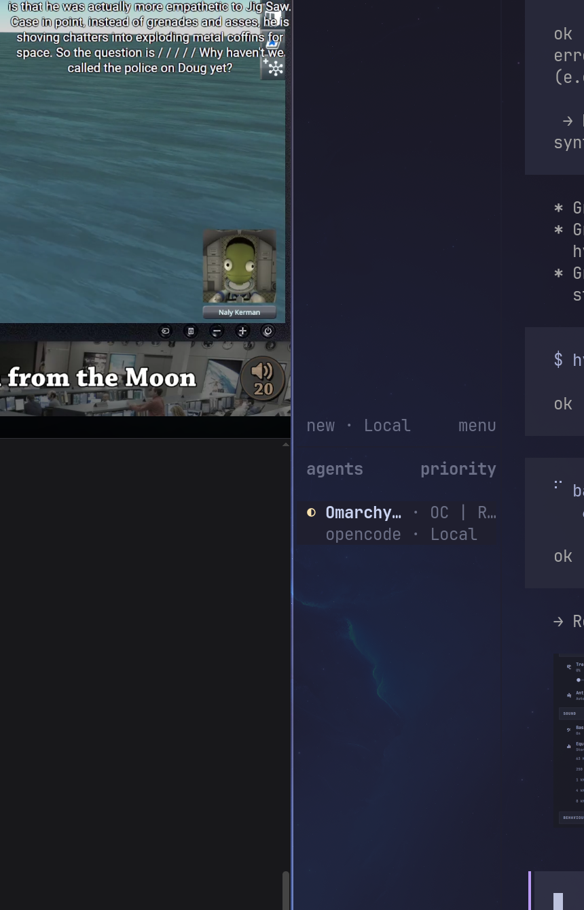

# Momentum for Omarchy

A CLI and Omarchy control panel for Sennheiser Momentum 4 headphones. The panel
shows the headset battery and firmware version and controls:

- Noise control: transparency (off, adaptive or a custom level) and anti-wind
- Sound: bass boost, and the equaliser's presets and band sliders
- Behaviour: Smart Pause, on-head detection, auto-answer, Comfort Call, touch
  controls and auto power off



## Requirements

- Omarchy Quattro, for the panel
- `bluetoothctl`, from `bluez-utils`
- A paired and connected Sennheiser Momentum 4

The headset protocol is reverse-engineered and features may vary with firmware.
Settings the firmware rejects are hidden in the panel. Neither the CLI nor the
panel implements firmware updates, factory resets, or undocumented commands.

## The momentum CLI

Install `momentum-bin` or `momentum-git` from the AUR, or a package from the
[releases](https://github.com/timmo001/omarchy-momentumctl/releases).

```bash
momentum status
momentum set transparency 40
momentum set eq-preset harman
momentum set eq -3.5 -0.5 2.5 -0.5 -0.5
momentum --help
```

The CLI finds the first connected Bluetooth device named MOMENTUM. Set
`MOMENTUM_ADDRESS` to pick one by address instead.

### Equaliser

The headset has five bands, labelled 63 Hz, 250 Hz, 1 kHz, 4 kHz and 8 kHz in
Smart Control. Gains are in dB, in tenths. The presets are Smart Control's
eight, plus a Harman preset fitted from AutoEq's Momentum 4 corrections. The
curve is stored on the headset, so it carries over to other devices.

## Install the panel

Install the `momentum` CLI first. Review the plugin, then install it:

```bash
omarchy plugin add https://github.com/timmo001/omarchy-momentumctl.git
```

For an unattended install from a repository you already trust:

```bash
omarchy plugin add \
  https://github.com/timmo001/omarchy-momentumctl.git \
  --enable --yes
```

Open the panel through its shell IPC target:

```bash
omarchy-shell shell toggle timmo.momentumctl
```

Bind that command to a desktop hotkey for direct access.

In the panel, Up and Down move between controls, Enter activates the selected
one, and Left and Right change the selected choice, level, preset or band.
Enter on a band's value resets it to 0 dB. Type to filter the controls, and
press Escape to clear the filter or close the panel.

## Update

```bash
omarchy plugin update timmo.momentumctl
```

## Remove

```bash
omarchy plugin remove timmo.momentumctl
```

## Development

```bash
mise run build          # compile dist/momentum
mise run check          # CLI tests, lint, types and formatting
mise run check:plugin   # plugin manifest and QML
```

## Credits

The headset protocol is reverse-engineered by the community and is not an
official Sennheiser API. This project builds on:

- [omarchy-momentum4](https://github.com/DanSmith888/omarchy-momentum4) by
  Daniel Smith (MIT), whose `PROTOCOL.md` documents the GAIA commands used
  here, and whose `presets.json` supplies Smart Control's EQ preset values.
- [momentum4-control](https://github.com/f3Y0/momentum4-control) by f3Y0
  (MIT), the source of the protocol constants and the RFCOMM channel-probing
  approach.
- [momentumctl](https://github.com/gjabell/momentumctl) by Galen Abell (MIT),
  which the panel used before the `momentum` CLI, and the source of the
  battery, on-head, auto-answer, Smart Pause and Comfort Call command IDs.
- [AutoEq](https://github.com/jaakkopasanen/AutoEq) by Jaakko Pasanen, with
  Momentum 4 measurements from RTINGS and oratory1990, for the Harman preset.
